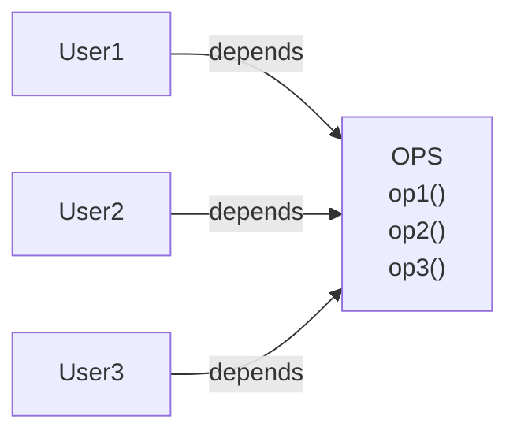
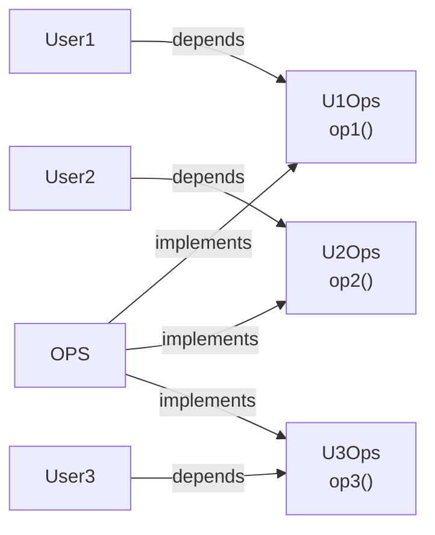
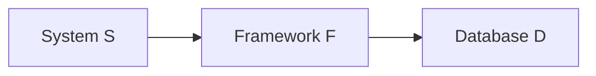

# Interface Segregation Principle

A client should not depend on operations it does not use. An interface should expose the capabilities required by a particular client, so changes to unrelated capabilities do not propagate to that client.

## Broad Interfaces Create Unnecessary Dependencies

Suppose three users depend on one `OPS` class. `User1` calls only `op1()`, `User2` calls only `op2()`, and `User3` calls only `op3()`.

Each user depends on the declaration of every operation even though it uses only one. Changing `op2()` forces `User1` and `User3` to be recompiled and redeployed as dependents of `OPS`.

## Client-Specific Interfaces Isolate Changes

Separate interfaces can describe only the operation required by each user. The `OPS` implementation may still provide all three operations, but the users no longer depend on that concrete class or on one another's operations.

A change to `op2()` now affects the `U2Ops` dependency surface without changing those used by `User1` or `User3`. Segregation is therefore about aligning dependencies with client needs, not making every interface arbitrarily small.

## Unnecessary Dependencies Scale to Architecture

The same effect occurs between architectural components. Suppose system `S` depends on framework `F`, which depends on database component `D`.

Framework `F` is bound to database `D` even though `D` contains features that neither `F` uses nor system `S` needs. Changes to those features may still force `F`, and then `S`, to be redeployed. A failure in an unused feature of `D` may likewise cause failures in both `F` and `S`.

Interfaces and component boundaries should expose only the capabilities their clients require. Depending on a module that carries unrelated functionality allows unexpected change and failure pressure to propagate through the dependency chain.

## Source Reference

- [[source-clean-architecture|Clean Architecture]], Chapter 10: ISP: The Interface Segregation Principle
