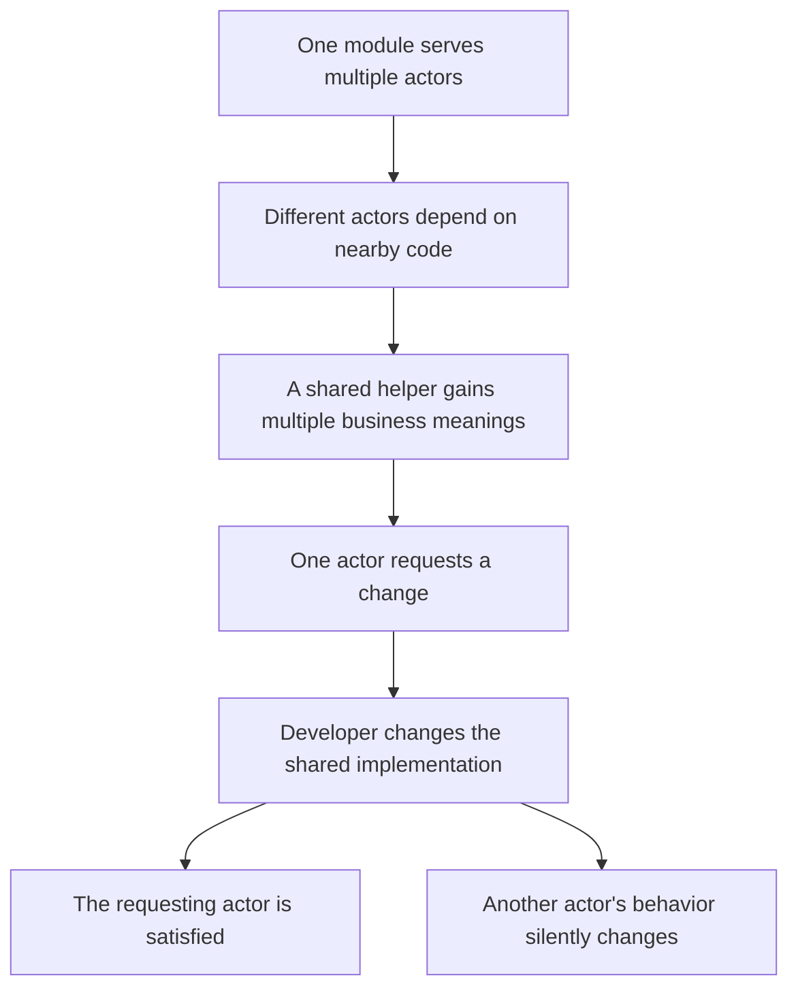

# Single Responsibility Principle

SRP says a module should be responsible to one actor.

An actor is a group of people who require the same kind of change. The principle is about change ownership: code that changes for different actors should not be packed into the same module just because it is about the same noun.

## Core Distinction

| Misread SRP | Useful SRP |
| --- | --- |
| A module should do one thing. | A module should answer to one actor. |
| Count behaviors or methods. | Identify who can force change. |
| Split by surface topic. | Split by change pressure. |
| "Employee" sounds like one responsibility. | Payroll, reporting, and persistence may belong to different actors. |

The "one thing" rule is useful for small functions. SRP asks a different question: why does this module change?

## Failure Path

The failure is not simply duplicated code. It can appear when developers remove duplication too eagerly and place shared code behind responsibilities that only look similar.

## Example

In a payroll system, an `Employee` module might contain:

| Code | Actor | Reason to change |
| --- | --- | --- |
| `calculatePay()` | accounting | compensation rules |
| `reportHours()` | HR | labor reporting rules |
| `save()` | database administration | persistence rules |

`calculatePay()` and `reportHours()` may both need regular hours. If they share `regularHours()`, that helper can become a hidden coupling point.

Accounting may change the definition for pay calculation while HR still needs the old reporting meaning. A change that is correct for payroll can make reports wrong.

## Design Response

Separate code by actor-owned change pressure.

Common responses:

- move pay calculation, hour reporting, and persistence into separate behavior classes
- let those classes share simple data when needed
- use a facade if callers need one coordinating entry point

The target is not "one method per class." A responsibility can contain many private helpers. The target is one reason to change, owned by one actor.

## Use It When

- one file changes for several unrelated business reasons
- different teams repeatedly edit the same module
- a shared helper means different things to different callers
- a class seems cohesive by noun but incohesive by change owner
- merge conflicts expose unrelated responsibilities living together

## Source Reference

- [[source-clean-architecture|Clean Architecture]], Chapter 7: SRP: The Single Responsibility Principle
